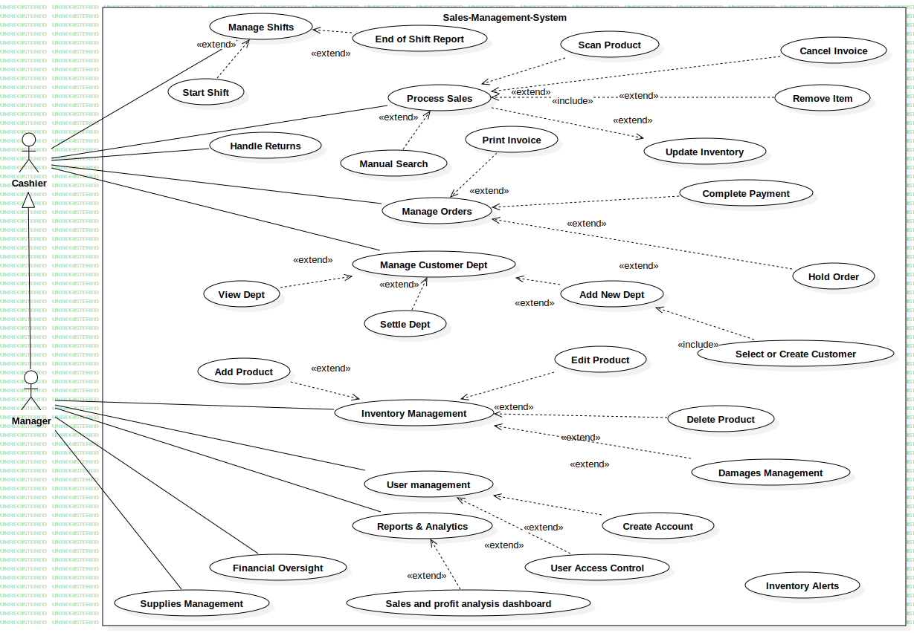
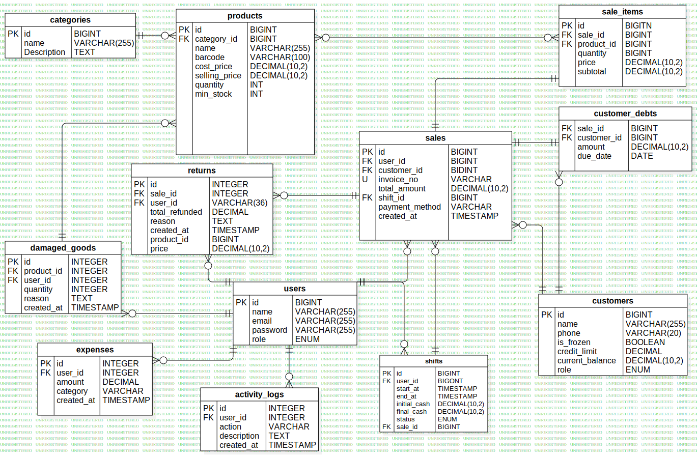

# Sales-Management-System
Professional Sales &amp; Inventory Management System built with Laravel 12 and React.js.

## Project Roadmap & Planning
You can track our detailed user stories and development progress on Trello:
 [Trello Board: Sales Management System](https://trello.com/b/Du8pD9Ve/sales-management-system-development-roadmap)

## User Stories Summary

### Cashier Module
- Shift Management: Log in/out to track sales sessions.
- POS Operations: Scan products via barcode or manual search.
- Payments: Support for cash, card, and customer debt recording.

### Manager Module
- Inventory Control: Full CRUD operations for products and categories.
- Stock Alerts: Notifications for low stock levels.
- Analytics: Visual dashboards for sales, profits, and wastage reports.

##  System Design & Architecture

### Use Case Diagram
This diagram illustrates the functional requirements of the system, showcasing the interactions between the Cashier, Manager, and the system's core modules.

### Entity Relationship Diagram (ERD)
The following diagram represents the database schema, detailing the relationships between key entities such as Users, Products, Sales, and Customer Debts.

## Tech Stack
- Framework: Laravel 12
- Frontend: React.js
- Database: MySQL
- Management: Trello (Initial Planning) & Jira (Sprint Management & Backlog) & GitHub Issues
